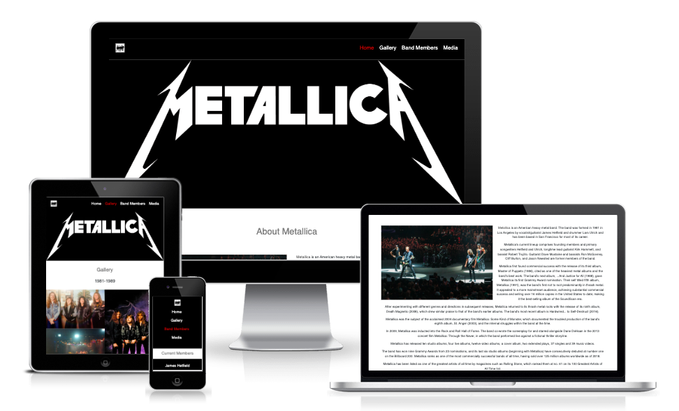

[Click Here to View the Website!](https://alexzanotti.github.io/metallica_website_milestone_project_1/)

# Purpose
This website was made to provide information and content regarding the metal band Metallica. A home page contains information about the band, as well as links to other pages of the site. The gallery page provides images of the band throughout the decades. The media page provides audio samples of songs from the band, live music videos and interviews with the band.

The target audience is anyone who is a fan of the band itself, metal music fans in general or users who'd like to learn more about the band (more on ideal users/user stories below).

This website was made for the first of four milestone projects required to complete the diploma in software development program at The Code Institute.

# Project Requirements
In order to pass this milstone project, the following requirements must be met:
1. Technologies Required: HTML, CSS 
2. Optional Technologies: Bootstrap and/or other CSS libraries/frameworks.
3. Static front end project: Write custom HTML5 and CSS3 code to create a website of at least 3 pages, or (if using a single scrolling page), at least 3 separate page areas.
4. Information Architecture: Incorporate a main navigation menu and structured layout (you might want to use Bootstrap to accomplish this).
5. Documentation: Write a README.md file for your project that explains what the project does and the value that it provides to its users.
6. Version Control: Use Git & GitHub for version control.
7. Attribution: Maintain clear separation between code written by you and code from external sources (e.g. libraries or tutorials). Attribute any code from external sources to its source via comments above the code and (for larger dependencies) in the README.
8. Deployment: Deploy the final version of your code to a hosting platform such as GitHub Pages.

# UX

## The ideal users for this website are:
* Metallica Fans
* Metal Fans
* Interested in learning more about Metallica

### Metallica Fans User Stories

* As a Metallica fan, I want to see images of the band throughout the years.
* As a Metallica fan, I want to watch interviews of the band, to know the band beyond just the music

### Metal Fans User Stories

* As a metal fan, I want to listen to audio samples of the band, to see whether i like the music 
* As a metal fan, I want to watch live music videos of some of the most popular songs

### Interested in learning more about Metallica User Stories

* As a user interested in learning more about Metallica, I want to have basic information about the band
* As a user interested in learning more about Metallica, I want to view information about the band members

## User Story Images 

### User Story 1
* As a Metallica fan, I want to see images of the band throughout the years.
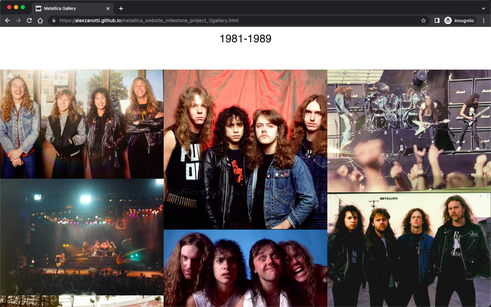

### User Story 2
* As a Metallica fan, I want to watch interviews of the band, to know the band beyond just the music
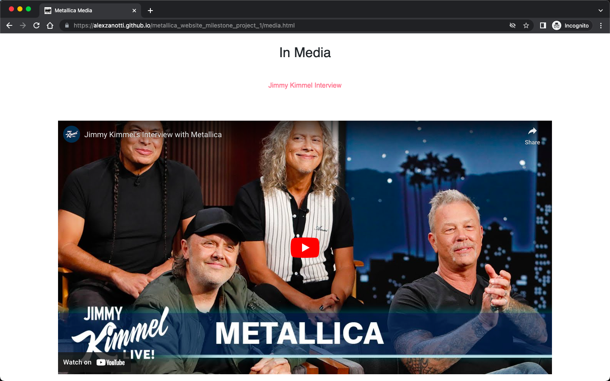

### User Story 3
* As a metal fan, I want to listen to audio samples of the band, to see whether i like the music 
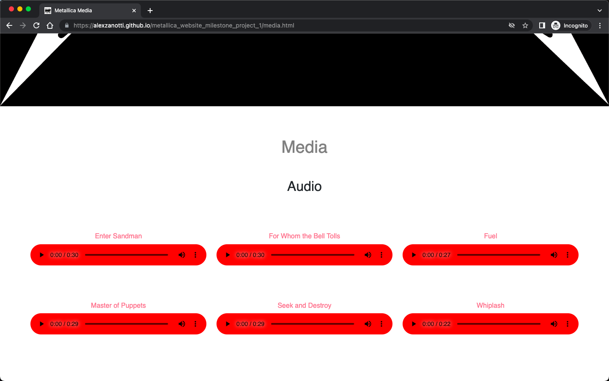

### User Story 4
* As a metal fan, I want to watch live music videos of some of the most popular songs
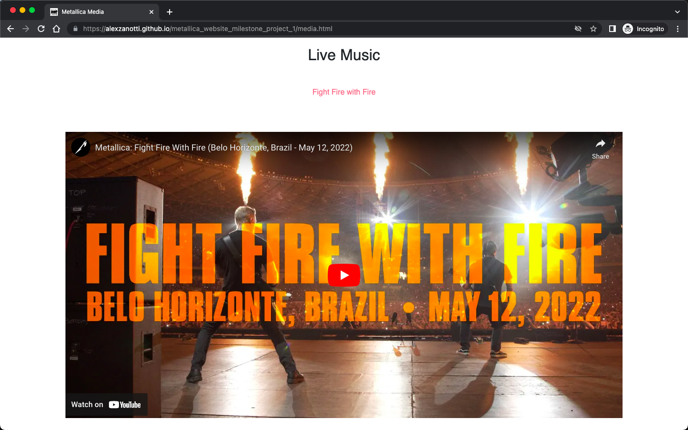

### User Story 5
* As a user interested in learning more about Metallica, I want to have basic information about the band
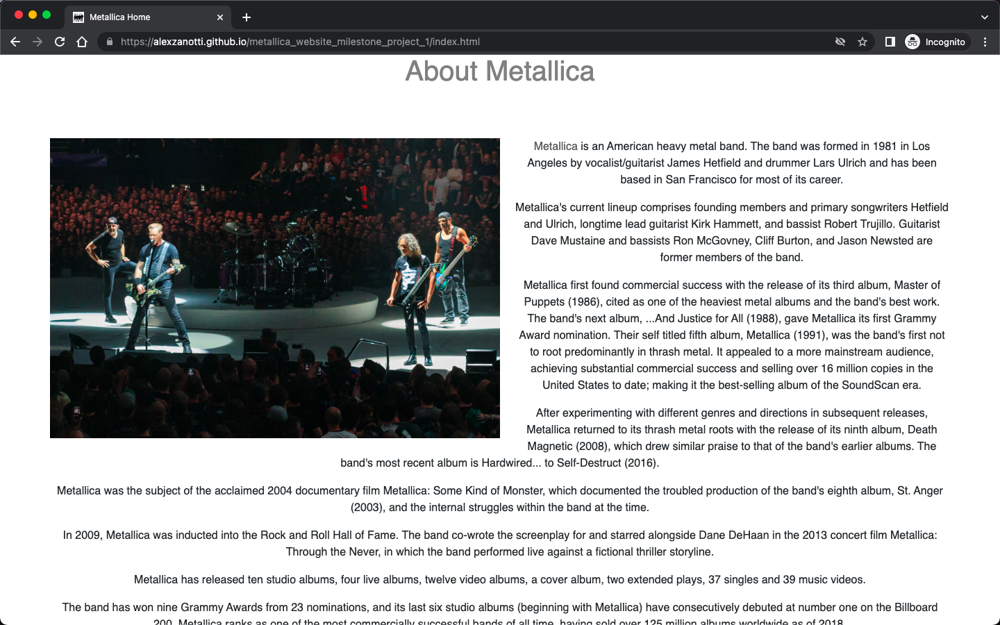

### User Story 6
* As a user interested in learning more about Metallica, I want to view information about the band members
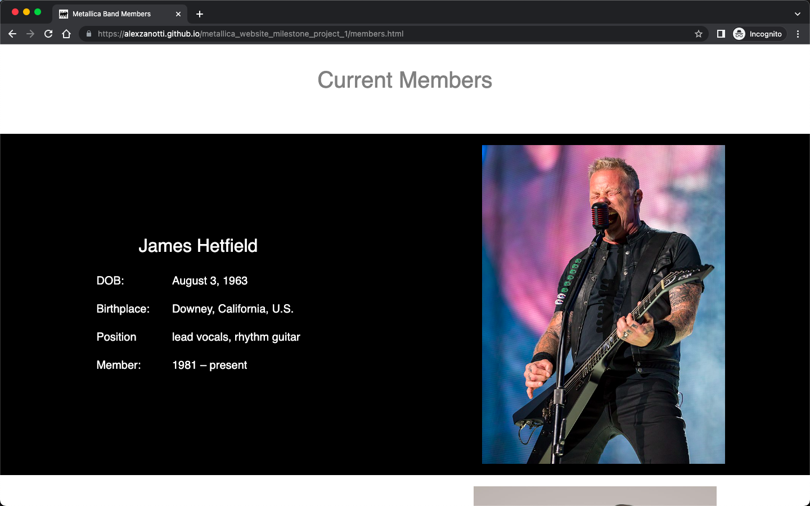

## Value to users

In general, the design of the website is in line with the Metallica brand - the website is responsively designed, to make for a pleasant user experience.

Value has been provided to satisfy the various user profiles/stories, as the website was structured around the user stories. For example, there is a user story for the Metallica fan to be able to see images of the band throughout the years. Value provided by the website to satisfy this user requirement is having a gallery page, where pictures have been displayed in a stylish manner through each decade of the band since inception.

In another example of value provided to the user, there is a user story for a metal fan to be able to listen to audio snippets of the band songs, to gauge whether they like the music produced by Metallica. To answer this user story, a media page has been created that contains an audio section, providing 30 seconds of some of the most popular Metallica songs. The user can start/stop these audio snippets to get a better understanding of whether they'll like the Metallica songs.

# Features
The details of features on the site are detailed below.
## Head
- Each page of the website contains a relevant title and metallica icon image.
## Header
- The **navbar** list items are displayed inline for larger screens, floated to the right.
- A square image **icon** is floated to the left of the page for larger screens. This icons is clickable and takes you to the home page.
- For mobile devices, the **navbar** and **icon** image is block displayed, which creates a good user experience.
- The Metallica image is also only displayed for larger screens.
- The color of the navigation item is red for the page the user is currently on.
- When hovering over another navigation item, the colour changes to red.
## Footer
- The footer contains a **social links** section, using **fontawesome** icons
- When hovering over the **social link icon**, the icon turns red 
- The footer also contains a **site map section**, also using **fontawesome** icons.
- When hovering over the **site map icon**, the icon turns re
## Home Page
- The **Home Page** contains and about the band section, that provides information about the band
- The about the band section also displays a picture floated to the left of the paragraphs for larger screens
- The picture is displayed above the paparagraphs for phone devices
- There are 3 cards on the home page which are clickable and allow the user to easily navigate to other pages of the website.
- The colour of the cards changes to a darker grey colour when hovering.
## Band Members
- The band member page contains images of the band members
- A table is displayed for each band member, give detals about their place of birth, DOB, position in the band etc.
- The page is responsively setup - larger screens display the image and information in an inline format - phone screens present the infomation in block display for a good user experience.
## Gallery
- The gallery page contains 10 images per decade since the bands inception.
- The images are displayed in 3 columnn for large screens, 2 columns for medium screens and 1 column for small screens (i.e phone)
## Media Page
- The Media page also features **Audio** elements.
- These utilise bootstrap to display the elements responsively, depending on the screen size (3 audio elements per row for large screens, 2 for medium screens and 1 for small screens)
- The Media page features **Youtube Embed** for Metallica songs and interviews.
- They utilise the bootstrap to display the video responsively to fit the screen size.

# Technologies Used

## Main Technologies Used
### HTML5
### CSS3

## Frameworks, Libraries & Programs Used
### Bootstrap
Bootstrap was used in the media page to assist with enabling a responsive design
### Google Fonts
Google fonts was used to import the font "Roboto" into the style.css file. This font was used throughout the project.
### Font Awesome
Font Awesome was used on all pages in the footer to denote the social links and site map links.
### GitPod
GitPod was used for writing code, commiting, and then pushing to GitHub.
### GitHub
GitHub was used as the repository for the code.
### Balsamiq
Balsamiq was used to create the wireframes during the design of the project.

#### Balsamiq Wireframe Images
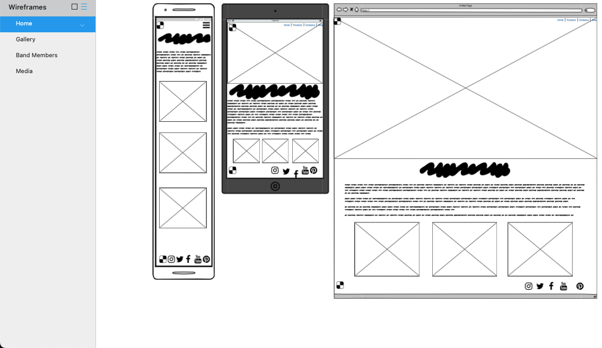
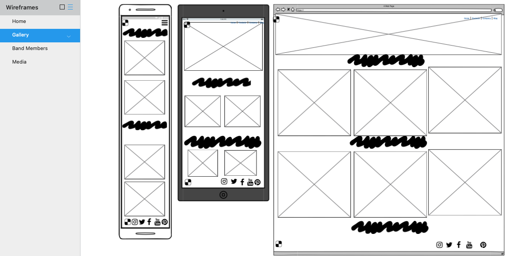
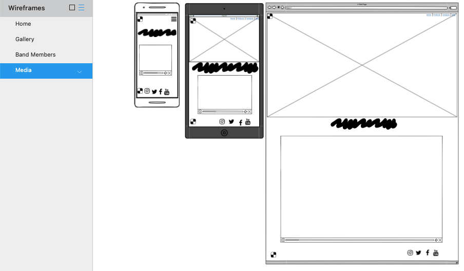
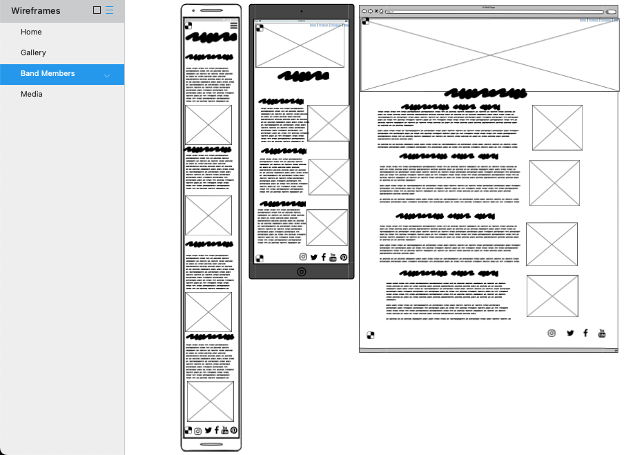

# Testing
Testing information can be found the the following [file](TESTING.md "Link to testing file")

# Deployment

This project was developed using [GitPod](https://www.gitpod.io/ "Link to GitPod site"), which was then committed and pushed to GitHub using the GitPod terminal.

## Deploying on GitHub Pages
To deploy this page to GitHub Pages from its GitHub repository, the following steps were taken:

1. Log into [GitHub](https://github.com/login "Link to GitHub login page") or [create an account](https://github.com/join "Link to GitHub create account page").
2. Locate the [GitHub Repository](https://github.com/alexzanotti/metallica_website_milestone_project_1 "Link to GitHub Repo").
3. At the top of the repository, select Settings from the menu items.
4. Scroll down the Settings page to the "Pages" section.
5. Under "Source" click the drop-down menu labelled "None" and select "Main".
6. Upon selection, the page will automatically refresh meaning that the website is now deployed.
7. Scroll back down to the "Pages" section to retrieve the deployed link.

# Credits

## Content
Some of the text used in the the various pages were borrowed and adapted from various sites, listed below.
* Wikipedia
* Metallica.com

## Media
All images were sourced from either the Metallica website or through google images.
All audio files were sourced from Wikipedia
All videos were sourced from the official metallica youtube channel.

## Code
The developer consulted multiple sites in order to better understand the code they were trying to implement. 

The following sites were used:
* Code Institute Training Material
* Youtube
* Stack Overflow
* W3Schools
* Getbootstrap
* Font Awesome
* flexboxfroggy
* https://github.com/adam-p/markdown-here/wiki/Markdown-Cheatsheet - this is where syntax for the README.md & TESTING.md files were sourced
* www.freeformatter.com

# Acknowledgements
I would like to thank the Code Institute for providing the course content that has allowed me to build this website.

I would like to thank my mentor, Seun, for their invaluable help and guidance throughout the process.