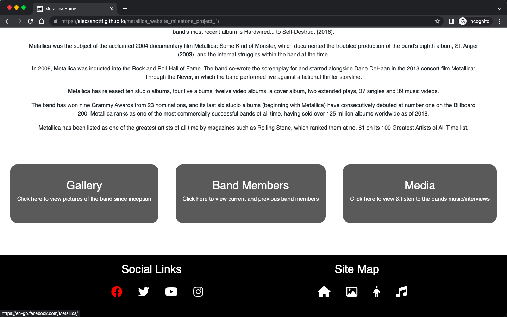

# Testing

## Testing Procedure

Testing has been split into several sections. 

The first section of testing has been completed around validating that the user stories are met by the website.

Manual testing is the next section of testing - this is split between Functionality/Usability testing, which ensures that the website functions correctly are is useable by the user. The second part of manual testing to responsiveness testing - this ensures that the responsive design of the website is working correctly.

The next section of testing is automated testing - this looks at validating that the code itself is free from errors using.

Browser testing is the next section of testing - this ensures that the website functions in multiple browsers.

Finally, a Lighthouse Report is produced for each page of the website.

### User Story Testing

#### As a Metallica fan, I want to see images of the band throughout the years.
* A gallery page has been setup that displays images of the band
* The gallery is split by decade

#### As a Metallica fan, I want to watch interviews of the band, to know the band beyond just the music
* The Media page contains 3 videos embedded from youtube that are interviews with the Metallica band.

#### As a metal fan, I want to listen to audio samples of the band, to see whether i like the music 
* On the Media page, there are 6 audio elements, that play 30 seconds of the bands most popular songs.

#### As a metal fan, I want to watch live music videos of some of the most popular songs
* On the Media page, there are 3 videos embedded from youtube of live music videos.

#### As a user interested in learning more about Metallica, I want to have basic information about the band
* The home page of the website contains a section providing information about the band (this is sourced from Wikipedia).

#### As a user interested in learning more about Metallica, I want to view information about the band members
* The website contains a band members page, which provides basic facts about both current and previous band members.

### Manual Testing

#### Functionality & Usability

The following screenshots demonstrate functionality and usability of the website:

##### Navigation Bar 

##### Social Links

##### Twitter Link

##### Instagram Link

##### Youtube Link

##### Sitemap Link

##### Video Plays

##### Audio Plays

#### Responsiveness 

A number of aspects of the website were designed to be responsive to the users device - below are screenshots showing the area in scope (Header etc.) and the design for the various breakpoints. This was completed using Media queries and the bootstrap framework.

#### Header
##### Large

##### Small

#### Footer
##### Large

##### Small

#### Members
##### Large

##### Small

#### Gallery
##### Large

##### Medium

##### Small

#### Audio
##### Large

##### Medium

##### Small

### Automated Testing
The W3C Markup Validator service was used to validate the HTML and CSS code used.

Below are screenshots showing each page of the project passing the validation checks.

### style.css

### index.html

### gallery.html

### members.html

### media.html

### Browser Testing

#### Chrome
* The Media page of the website is working correctly in Google Chrome

#### Firefox
* The Home page of the website is working correctly in Firefox

#### Edge
* The Band Members page of the website is working correctly in Edge

#### Safari
* The Gallery page of the website is working correctly in Safari

### Lighthouse Report

#### Home Page

#### Gallery Page

#### Band Member Page

#### Media Page
