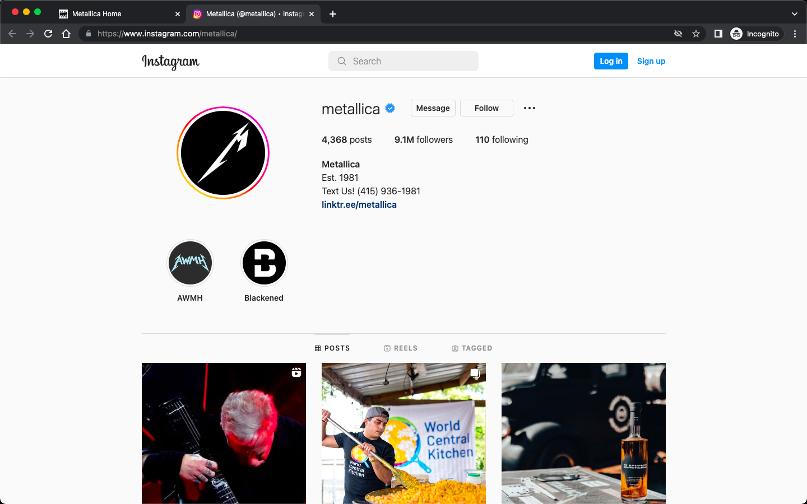
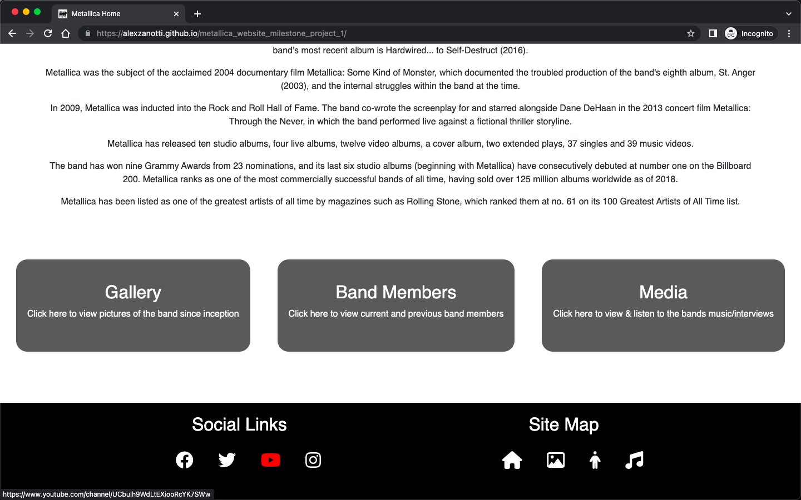
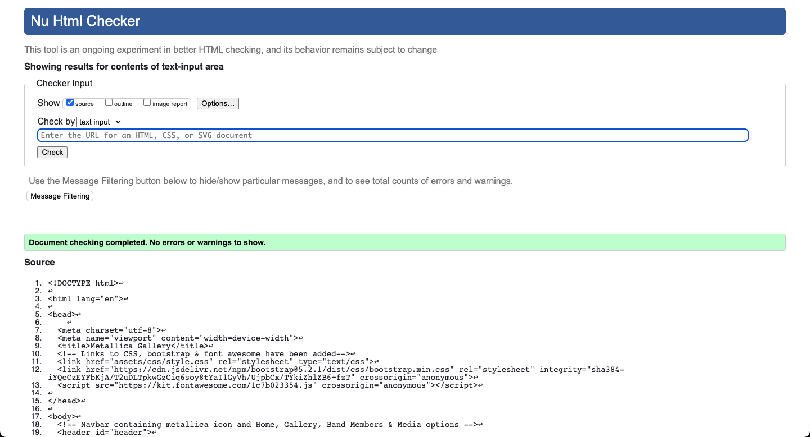

# Testing

## Testing Procedure

Testing has been split into several sections. 

The first section of testing has been completed around validating that the user stories are met by the website.

Manual testing is the next section of testing - this is split between Functionality/Usability testing, which ensures that the website functions correctly are is useable by the user. The second part of manual testing to responsiveness testing - this ensures that the responsive design of the website is working correctly.

The next section of testing is automated testing - this looks at validating that the code itself is free from errors using.

Browser testing is the next section of testing - this ensures that the website functions in multiple browsers.

Finally, a Lighthouse Report is produced for each page of the website.

### User Story Testing

#### As a Metallica fan, I want to see images of the band throughout the years.
* A gallery page has been setup that displays images of the band
* The gallery is split by decade

#### As a Metallica fan, I want to watch interviews of the band, to know the band beyond just the music
* The Media page contains 3 videos embedded from youtube that are interviews with the Metallica band.

#### As a metal fan, I want to listen to audio samples of the band, to see whether i like the music 
* On the Media page, there are 6 audio elements, that play 30 seconds of the bands most popular songs.

#### As a metal fan, I want to watch live music videos of some of the most popular songs
* On the Media page, there are 3 videos embedded from youtube of live music videos.

#### As a user interested in learning more about Metallica, I want to have basic information about the band
* The home page of the website contains a section providing information about the band (this is sourced from Wikipedia).

#### As a user interested in learning more about Metallica, I want to view information about the band members
* The website contains a band members page, which provides basic facts about both current and previous band members.

### Manual Testing

#### Functionality & Usability

The following screenshots demonstrate functionality and usability of the website:

##### Navigation Bar 

* Hovering over home works correctly in changing the color to red

* Clicking home then takes you to the home page correctly

* Hovering over gallery works correctly in changing the color to red

* Clicking gallery then takes you to the gallery page correctly

* Hovering over band members works correctly in changing the color to red

* Clicking band members then takes you to the band members page correctly

* Hovering over media works correctly in changing the color to red

* Clicking media then takes you to the media page correctly

##### Social Links
* Hovering over the Facebook icon in the footer works correctly in changing the color to red

* Clicking the Facebook icon in the footer correctly takes you to the facebook page in a new tab

##### Twitter Link
* Hovering over the Twitter icon in the footer works correctly in changing the color to red

* Clicking the Twitter icon in the footer correctly takes you to the Twitter page in a new tab

##### Instagram Link
* Hovering over the Instagram icon in the footer works correctly in changing the color to red

* Clicking the Instagram icon in the footer correctly takes you to the Instagram page in a new tab

##### Youtube Link
* Hovering over the Youtube icon in the footer works correctly in changing the color to red

* Clicking the Youtube icon in the footer correctly takes you to the Youtube page in a new tab

##### Sitemap Link
* Hovering over the Home icon in the footer works correctly in changing the color to red

* Clicking the Home icon then takes you to the Home page correctly

* Hovering over the Gallery icon in the footer works correctly in changing the color to red

* Clicking the Gallery icon then takes you to the Gallery page correctly

* Hovering over the Members icon in the footer works correctly in changing the color to red

* Clicking the Members icon then takes you to the Members page correctly

* Hovering over the Media icon in the footer works correctly in changing the color to red

* Clicking the Media icon then takes you to the Media page correctly

##### Video Plays
* When clicking play on the embedded video, the video begins

##### Audio Plays
* When clicking play on the Audio element, the audio starts

#### Responsiveness 

A number of aspects of the website were designed to be responsive to the users device - below are screenshots showing the area in scope (Header etc.) and the design for the various breakpoints. This was completed using Media queries and the bootstrap framework.

#### Header
##### Large
* The header for larger screens displays the navbar inline and floating to the right. The image icon is floated to the left. The Metallica Image is correctly showing across 100% of the width of the screen.

##### Small
* Smaller screens correctly display the Navbar in block - the Metallica image is not displayed (which is correct).

#### Footer
##### Large
* The footer contains the social and sitemap icons, displayed inline

##### Small
* Due to width constraints, the social links and sitemap sections are displayed in rows (the icons remain inline however)

#### Members
##### Large
* The Band Members page displays the information about the member alongside an image of the member on larger screens

##### Small
* The display changes to block for smaller screens

#### Gallery
##### Large
* The gallery correctly displays 3 columns when on larger screens

##### Medium
* The gallery correctly displays 2 columns when on medium sized screens

##### Small
* The gallery correctly displays 1 column when on smaller screens

#### Audio
##### Large
* The media page correctly displays 3 audio elements inline when on larger screens

##### Medium
* The media page correctly displays 2 audio elements inline when on medium sized screens

##### Small
* The media page correctly displays 1 audio element per row when on smaller screens

### Automated Testing
The W3C Markup Validator service was used to validate the HTML and CSS code used.

Below are screenshots showing each page of the project passing the validation checks.

### style.css
* The style.css file contains no errors when put through a code validator

### index.html
* The index.html file contains no errors when put through a code validator

### gallery.html
* The gallery.css file contains no errors when put through a code validator

### members.html
* The members.css file contains no errors when put through a code validator

### media.html
* The media.css file contains no errors when put through a code validator

### Browser Testing

#### Chrome
* The Media page of the website is working correctly in Google Chrome

#### Firefox
* The Home page of the website is working correctly in Firefox

#### Edge
* The Band Members page of the website is working correctly in Edge

#### Safari
* The Gallery page of the website is working correctly in Safari

### Lighthouse Report

#### Home Page
* The Home page returned high scores in all areas of the lighthouse report, with the exception of the performance - this is a future consideration when making updates

#### Gallery Page
* The Gallery page returned high scores in all areas of the lighthouse report, with the exception of the performance - this is a future consideration when making updates

#### Band Member Page
* The Band Members page returned high scores for all aspects of the lighthouse report

#### Media Page
* The Media page returned high scores in all areas of the lighthouse report, with the exception of the performance - this is a future consideration when making updates
